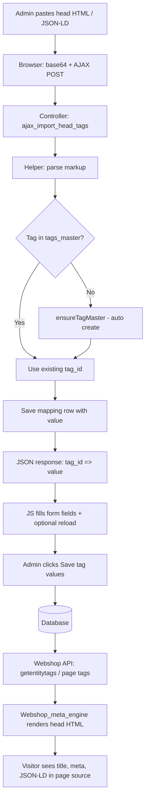
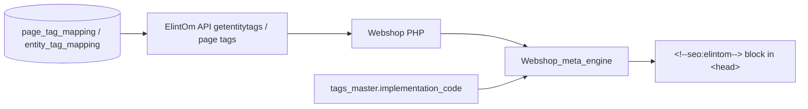

# CMS — Import from Head Script

This document explains **what** the “Import from head script” feature does, **why** it exists, and **how** pasted HTML/JSON becomes SEO output on the webshop.

---

## 1. Business concept

### Problem

SEO work is often done as raw `<head>` markup:

- `<title>`, `<meta name="description">`, canonical links  
- Open Graph (`og:title`, `og:image`, …)  
- Geo meta (`geo.region`, …)  
- JSON-LD (`<script type="application/ld+json">`) for Product, Organization, FAQ, etc.

In ElintOm, that data is **not** stored as one big HTML blob. It is stored as **named tag values** linked to:

| Context | Who it applies to | Mapping table |
|--------|-------------------|---------------|
| **CMS Pages** | Static CMS pages (home, about, …) | `sma_page_tag_mapping` |
| **Entity Tags** | Products, categories, etc. | `sma_entity_tag_mapping` |

Each value is tied to a row in **`sma_tags_master`** (the Tag Master catalog).

### Solution

The import box lets an admin **paste existing head HTML** (from another site, an SEO tool, or a developer) and the system:

1. **Parses** the markup into individual tag names + values  
2. **Creates** any missing Tag Master definitions automatically  
3. **Saves** values to the page or entity mapping  
4. **Fills** the form fields above so you can review/edit before final save  

On the **webshop**, those values are read via API and **rendered back into `<head>`** using each tag’s `implementation_code` template.

### Business value

- Faster migration of SEO from legacy sites or spreadsheets  
- One source of truth in the database (not copy-paste into theme files)  
- Same tag catalog for CMS pages and product/category entity tags  
- Structured data (JSON-LD) stored per product/page, not hard-coded in PHP views  

---

## 2. Where the UI appears

| Screen | URL pattern | When import is available |
|--------|-------------|-------------------------|
| CMS Page edit | `/cms_admin/pages/edit/{page_id}` | After page is created |
| Entity tag edit | `/cms_admin/entity_tags/edit/{type_id}/{entity_id}` | When mapping exists |
| Entity tag add | `/cms_admin/entity_tags/add` | After **Type** and **Entity** are selected |

The panel is at the bottom of **Tag values by category**, below the category tabs (SEO, Schema, GEO, AI, …).

---

## 3. End-to-end flow (high level)



---

## 4. Step-by-step logic

### Step 1 — Paste and click “Parse & fill tag fields”

**File:** `themes/default/assets/cms_admin/js/page-tag-import.js`

- Reads the import textarea  
- Encodes content as **Base64** (`head_markup_b64`) so WAF/XSS filters do not strip `<script>` or `<meta>`  
- Sends POST to:
  - Pages: `cms_admin/pages/ajax_import_head_tags/{page_id}`
  - Entities: `cms_admin/entity_tags/ajax_import_head_tags/{type_id}/{entity_id}`  
- Includes CSRF token  

### Step 2 — Read raw markup on server

**File:** `app/helpers/cms_head_tag_import_helper.php` → `cms_read_head_markup_from_post()`

- Prefers Base64 payload  
- Falls back to plain `head_markup` POST field  
- Normalizes escaped HTML (`&lt;title&gt;` → `<title>`)  
- Restores JSON-LD removed by XSS filter (`[removed]...[/removed]` wrappers)  

### Step 3 — Parse into tag name → value pairs

**File:** `app/helpers/cms_head_tag_import_helper.php` → `cms_parse_head_markup_for_tags()`

| Input pattern | Parsed tag name | Example value |
|---------------|-----------------|---------------|
| `<title>...</title>` | `title` | Page title text |
| `<meta name="description" content="...">` | `meta_description` | Description text |
| `<meta name="keywords" ...>` | `meta_keywords` | Keywords |
| `<meta property="og:title" ...>` | `og:title` | OG title |
| `<link rel="canonical" href="...">` | `canonical` | URL |
| `<meta name="geo.region" ...>` | `geo.region` | Region code |
| `<script type="application/ld+json">...</script>` | See JSON `@type` below | Raw JSON string |
| Bare JSON `{ "@type": "Product", ... }` | See JSON `@type` below | Raw JSON string |

**JSON-LD `@type` → tag field mapping:**

| `@type` (schema.org) | Tag name in Tag Master |
|----------------------|-------------------------|
| `Product` | `product_schema` |
| `Pharmacy`, `LocalBusiness` | `pharmacy_schema` |
| `Article`, `BlogPosting`, `NewsArticle` | `article_schema` |
| `FAQPage` | `faq_schema` |
| `CollectionPage`, `ItemList` | `category_schema` |
| `BreadcrumbList` | Skipped (webshop builds automatically) |
| `Organization`, `WebSite`, other | `schema_json` |

### Step 4 — Ensure tag exists in Tag Master

**File:** `app/models/cms_admin/Cms_admin_pages_model.php` → `ensureTagMaster()`

For each parsed tag name:

1. Look up `sma_tags_master` by `tag_name` (+ `tag_type`)  
2. If missing → **insert** new row using defaults from `cms_tag_master_catalog()`:
   - `tag_name`, `tag_type`, `category` (tab name: SEO, Schema, GEO, AI, …)  
   - `template` — placeholder pattern  
   - `implementation_code` — HTML template used when rendering on webshop  

3. If a **new category tab** was created → page **reloads** so the new tab/field appears  

Unknown tags (e.g. custom `meta name`) still get created with generic meta defaults.

### Step 5 — Save value to mapping table

**Pages:** `Cms_admin_pages_model::upsertPageTagValue()`  
→ `sma_page_tag_mapping` (`page_id`, `tag_id`, `property_name`, `value`)

**Entities:** `Cms_admin_entity_tags_model::upsertEntityTagValue()`  
→ `sma_entity_tag_mapping` (`entity_master_id`, `entity_id`, `tag_id`, `property_name`, `value`)

Import saves immediately; **“Save tag values”** on the form persists any further edits.

### Step 6 — Fill form fields in the browser

**File:** `page-tag-import.js` → `applyValuesToFields()`

- Sets `#tag_value_{tag_id}` for each imported tag  
- Switches to the tab that contains the first updated field  
- Highlights the field briefly  
- Schema fields use plain textareas (class `skip`) so Redactor editor does not hide JSON  

If new Tag Master rows were created → **alert + full page reload** (new tabs/fields).

---

## 5. Database model (conceptual)

```
sma_tags_master          ← Catalog: what tags exist, how they render
    id
    tag_name             e.g. meta_description, product_schema, og:title
    tag_type             meta | og | link | schema
    category             SEO | Schema | GEO | AI | Social | …
    template             {placeholder} pattern
    implementation_code  <meta ...> or <script>...</script> template

sma_page_tag_mapping     ← Values per CMS page
    page_id, tag_id, property_name, value

sma_entity_tag_mapping   ← Values per product/category/etc.
    entity_master_id, entity_id, tag_id, property_name, value
```

**Tag Master** = dictionary  
**Mapping tables** = actual content per page or entity  

---

## 6. How values render on the webshop

After import and save, the webshop does **not** use the pasted HTML directly. It uses **stored values + templates**.



**Files (webshop):**

- `application/helpers/webshop_helper.php` — `webshop_entity_tag_head_html()`  
- `application/libraries/Webshop_meta_engine.php` — builds meta tags, JSON-LD, OG, etc.  
- Product/category views inject the result into the page `<head>`  

For each mapping row the engine typically:

1. Takes `value` from the mapping  
2. Looks up `implementation_code` from Tag Master  
3. Substitutes the value into the template (or emits JSON-LD script for `tag_type = schema`)  
4. Outputs safe HTML in the `<!--seo:elintom-->` section  

**Example**

Stored value for `meta_description`:

```
Buy our test product online
```

Tag Master `implementation_code`:

```html
<meta name="description" content="{meta_description}">
```

Rendered on webshop:

```html
<meta name="description" content="Buy our test product online">
```

**Example — JSON-LD**

Stored value for `product_schema`:

```json
{"@context":"https://schema.org","@type":"Product","name":"Test"}
```

Rendered as:

```html
<script type="application/ld+json">{"@context":"https://schema.org","@type":"Product","name":"Test"}</script>
```

---

## 7. Example import input

```html
<title>Test Product Page</title>
<meta name="description" content="Buy our test product online">
<link rel="canonical" href="https://example.com/product/test">
<meta property="og:title" content="Test Product">
<meta property="og:image" content="https://example.com/img.jpg">
<script type="application/ld+json">
{"@context":"https://schema.org","@type":"Product","name":"Test"}
</script>
```

**Parsed result (6 tags):**

| Tag field | Value |
|-----------|--------|
| `title` | Test Product Page |
| `meta_description` | Buy our test product online |
| `canonical` | https://example.com/product/test |
| `og:title` | Test Product |
| `og:image` | https://example.com/img.jpg |
| `product_schema` | `{"@context":...,"@type":"Product",...}` |

---

## 8. Key source files (reference)

| Layer | File |
|-------|------|
| Parser & catalog | `app/helpers/cms_head_tag_import_helper.php` |
| Page import API | `app/controllers/cms_admin/Pages.php` → `ajax_import_head_tags()` |
| Entity import API | `app/controllers/cms_admin/Entity_tags.php` → `ajax_import_head_tags()` |
| Tag Master insert | `app/models/cms_admin/Cms_admin_pages_model.php` → `ensureTagMaster()` |
| Page mapping save | `Cms_admin_pages_model::upsertPageTagValue()` |
| Entity mapping save | `Cms_admin_entity_tags_model::upsertEntityTagValue()` |
| UI panel | `themes/default/views/cms_admin/_partials/head_tag_import_panel.php` |
| Browser logic | `themes/default/assets/cms_admin/js/page-tag-import.js` |
| Entity/page forms | `entity_tags/_tag_form.php`, `pages/edit.php` |
| Webshop render | `Webshop_meta_engine.php`, `webshop_helper.php` |

---

## 9. Operational notes

1. **Hard refresh** (Ctrl+F5) after code updates so CSS/JS load correctly.  
2. **Entity add screen:** select Type + Entity before import.  
3. **Schema fields** are full-width textareas; JSON should be valid if you expect clean JSON-LD output.  
4. **Auto product schema:** webshop may still add Product JSON-LD from DB product data unless entity tags already provide a full Product JSON-LD override.  
5. **Import ≠ publish:** for CMS pages, page status (draft/published) is separate from tag import.  
6. **Missing tab after import:** if a new tag category was created, the page reloads once to show the new tab.  

---

## 10. Summary in one sentence

**Paste head HTML → parser splits it into Tag Master fields → values save to page/entity mapping → webshop reads mappings and re-builds `<head>` HTML using each tag’s template — so SEO is manageable in CMS, not buried in theme files.**
